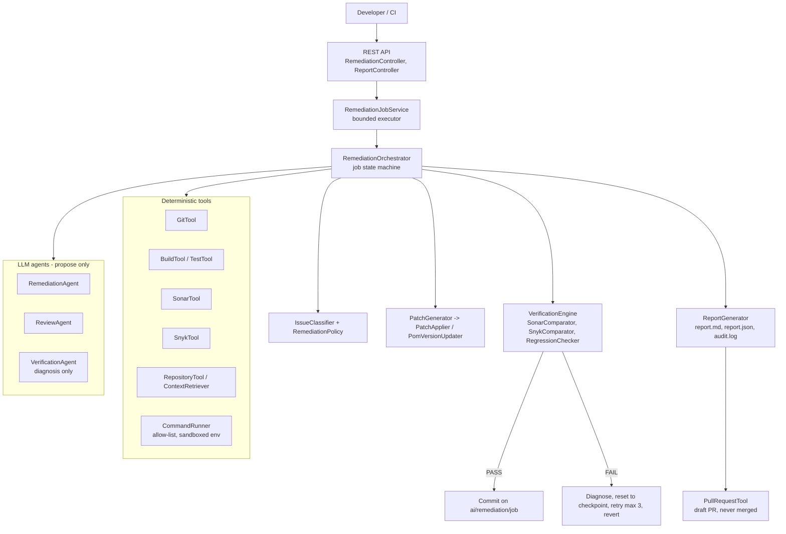

# AutoRemediate AI - System Design

**Principle:** LLM proposes. Deterministic tools verify. Human approves.

## 1. Goal

Given a Java/Maven repository with known Sonar/Snyk findings, safely apply minimal fixes, prove the repo still
builds and passes tests, prove the target finding is gone, detect new findings, and produce an auditable report
without ever touching the main branch.

## 2. Architecture



## 3. Job state machine

```
CREATED -> CLONING -> BASELINE -> SCANNING -> CLASSIFYING -> REMEDIATING -> BUILDING -> TESTING
        -> RESCANNING -> VERIFYING -+-> (PASS) next issue or REPORTING -> [PR_CREATED] -> COMPLETED
                                    +-> (FAIL) RETRY -> REMEDIATING ... (max attempts) -> REVERTED
FAILED reachable from any non-terminal state. Illegal transitions throw.
```

## 4. Per-finding flow

1. Skip if already resolved by an earlier fix; checkpoint = current commit.
2. Retrieve only relevant context (file window, matching tests, Java/Boot versions).
3. **Sonar:** LLM returns JSON search/replace edits; each `search` must match the original file exactly once.
   **Snyk:** LLM sanity-checks only; the pom change is made deterministically to the scanner-recommended version.
4. Policy checks: `.java` only (Sonar) / `pom.xml` only (Snyk), max files and changed lines, protected paths.
5. ReviewAgent reviews the diff (fails closed).
6. `mvn clean verify` -> parse Surefire/Failsafe XML -> Sonar and Snyk rescans.
7. **Safety gate.** PASS -> commit. FAIL -> diagnosis fed to next attempt, tree reset to checkpoint.

## 5. Safety gate (no LLM involved)

SAFE only if all hold: baseline build green; post build green; tests pass; test count not lower than baseline;
target finding resolved; no new Sonar issue; no new Snyk vulnerability; every scanner that worked on the baseline
also worked on the rescan.

- Sonar compared as a multiset of `rule|file|normalized message` (line shifts ignored).
- Snyk compared by `vulnId|package` (version excluded, since the fix changes it).
- After each accepted fix the new snapshot becomes the baseline for the next one.

## 6. Classification (V1)

| Finding | Class |
|---|---|
| Allow-listed Sonar rule (S1128, S1481, S1068, S3655, S1155, S1612, S125) | HIGH_CONFIDENCE (automated) |
| Rules like S2095, S2259, S1874 | MEDIUM (reported) |
| Unknown rule, no line number | LOW (reported) |
| VULNERABILITY / hotspot, auth/security/crypto paths | HUMAN_REVIEW_REQUIRED |
| Snyk direct, same-major upgrade with known fix | HIGH_CONFIDENCE |
| Snyk major upgrade | MEDIUM; transitive -> HUMAN_REVIEW_REQUIRED |

## 7. Security model

- Fresh clone + `ai/remediation/` branch only; push to main/master/develop/release refused; draft PRs; no auto-merge.
- Single process launcher `CommandRunner`: executable allow-list (mvn, mvnw, git, snyk), no shell, timeouts, bounded output,
  scrubbed environment (build/test code never sees API keys), secret redaction.
- LLM output is data: parsed to typed JSON, never executed; repository text is untrusted (tagged, system rule, single-pass templating).
- Repo URL/branch validation (no `--options`, `ext::`, credentials, plain http); optional `X-API-Key`.
- Sonar runs on a scratch project (`<key>-autoremediate`); server URL only from config.
- Secrets only via env vars; redacted from logs and reports; run inside a container.

## 8. Data model

`SonarIssue`, `SnykIssue` (sealed `Finding`), `ClassifiedFinding`, `FileEdit`, `SonarRemediationPlan`,
`SnykRemediationPlan`, `PatchResult`, `BuildResult`, `TestSummary`, `Snapshot`, `VerificationResult`,
`AttemptRecord`, `IssueOutcome`, `RemediationJob`, `RemediationReport`.

## 9. API

| Method | Path | Purpose |
|---|---|---|
| POST | `/api/remediation` | Start job -> `{jobId, status: STARTED}` |
| GET | `/api/remediation/{id}` | Status, fixed counts, build/tests, new issues, PR |
| GET | `/api/remediation/{id}/report?format=markdown\|json` | Auditable report |
| GET | `/api/remediation/{id}/audit` | Audit trail |

## 10. Configuration

`remediation.*` in `application.yml`: workspace, max attempts (3), max issues, build/Sonar/Snyk commands, AI provider/model/key
(model never hardcoded, temperature optional), git/PR settings, policy lists and size limits. Prompts are versioned files
(`system-v1`, `sonar-remediation-v1`, `snyk-remediation-v1`, `code-review-v1`, `verification-v1`); versions are recorded per job.

## 11. Deployment

Spring Boot jar in a Docker image that also contains JDK, Maven, Git and Snyk CLI; resource-limited container;
workspace volume `/work`. Jobs are in memory in V1.

## 12. Out of scope / next

Multi-module Sonar keys, targeted test selection, GitLab, persistent job store and queue, K8s sandbox workers,
parallel remediation, RBAC and rate limits.
